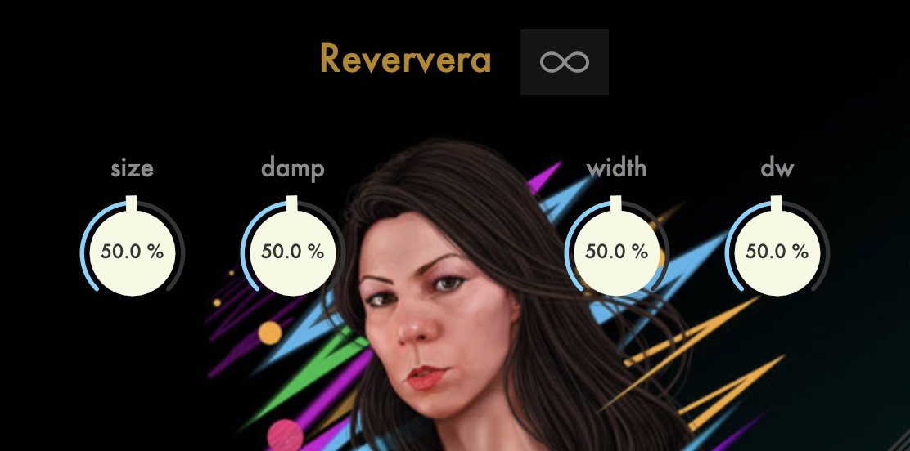

# Reververa

This is a simple reverb plugin made with the JUCE DSP module.




&nbsp;

### Features:

* Room size
* Time dampping
* Room with
* Dry / Wet mix
* Freeze

### Video Link

https://youtu.be/VXgEGejmi8o

### UI Manual

- undo: cmd + z
- redo: cmd + shift + z
- fine mode: shift + drag
- edit mode: 0-9 keypress
- reset: double click

### Building

```
$ git clone https://github.com/ezequielabregu/Reververa.git --recursive
$ cd Reververa
$ cmake -S . -B build -DCMAKE_BUILD_TYPE=Release
$ cmake --build build --config Release
```
